# Skip-5.16

Codebase for the 2026 season REBUILT

<!-- MERMAID_DIAGRAM_START -->
## Robot Structure

This diagram is automatically generated from the code in `src/main/java/frc/robot/` and updated during the build process.
It shows the relationships between subsystems, commands, and core robot classes.

**Legend:**
- `<<subsystem>>` - Robot subsystems that control hardware
- `<<command>>` - Commands that define robot behaviors
- `<<namespace>>` - Grouping of autonomous commands

To manually regenerate the diagram, run: `./gradlew generateMermaidDiagram`

```mermaid
classDiagram
    class Robot {
        +robotInit()
        +robotInit()
        +robotPeriodic()
        +disabledInit()
        +disabledPeriodic()
        +autonomousInit()
        +autonomousPeriodic()
        +teleopInit()
    }
    class RobotContainer {
        +robotState: RobotState
        +leds: LEDs
        +objectDetector: ObjectDetector
        +shooter: ShooterSuperstructure
        +intakeRoller: IntakeRoller
        +intakeLinear: IntakeLinear
        +indexer: Indexer
        +tower: Tower
        +controller: CommandXboxControllerExtended
        +getAutonomousCommand()
        +checkStartPose()
    }
    class Main {
        +main()
    }
    class Constants {
    }
    class Ports {
    }
    class RobotState {
        +getOdometryPose()
        +getEstimatedPose()
        +addOdometryObservation()
        +addVisionObservation()
        +getPoseAtTime()
        +getRotation()
        +getFieldRelativeVelocity()
        +publishMechanismPoses()
    }
    class FieldConstants {
        +getLayout()
        +getLayoutString()
    }
    class Drive {
        <<subsystem>>
        +periodic()
        +runVelocity()
        +runCharacterization()
        +stop()
        +stopWithX()
        +sysIdQuasistatic()
    }
    class GyroIO {
        <<subsystem>>
    }
    class GyroIOPigeon2 {
        <<subsystem>>
        +updateInputs()
        +getAccelerationX()
        +getAccelerationY()
        +getPitch()
        +getRoll()
    }
    class Indexer {
        <<subsystem>>
        +periodic()
        +setStateCommand()
        +holdStateUntilInterrupted()
        +nearSetpoint()
        +close()
        +getSpeed()
    }
    class IntakeLinear {
        <<subsystem>>
        +extend()
        +retract()
        +cycle()
        +stop()
        +periodic()
        +close()
    }
    class IntakeRoller {
        <<subsystem>>
        +setStateCommand()
        +holdStateUntilInterrupted()
        +stop()
        +nearSetpoint()
        +getVelocity()
        +periodic()
    }
    class LEDs {
        <<subsystem>>
        +periodic()
        +runDisabledAnimation()
        +runAutoAnimation()
    }
    class Module {
        <<subsystem>>
        +periodic()
        +runSetpoint()
        +runCharacterization()
        +stop()
        +getAngle()
        +getPositionMeters()
    }
    class ModuleIO {
        <<subsystem>>
    }
    class ModuleIOSim {
        <<subsystem>>
        +updateInputs()
        +setDriveOpenLoop()
        +setTurnOpenLoop()
        +setDriveVelocity()
        +setTurnPosition()
    }
    class ModuleIOTalonFX {
        <<subsystem>>
        +updateInputs()
        +setDriveOpenLoop()
        +setTurnOpenLoop()
        +setDriveVelocity()
        +setTurnPosition()
    }
    class ObjectDetector {
        <<subsystem>>
        +periodic()
    }
    class PhoenixOdometryThread {
        <<subsystem>>
        +getInstance()
        +registerSignal()
        +registerSignal()
        +makeTimestampQueue()
        +run()
    }
    class ShooterSuperstructure {
        <<subsystem>>
        +getHoodAngle()
        +getAverageFlywheelVelocity()
        +getAverageLinearVelocity()
        +spinUpShooter()
        +prepareShot()
        +setHoodAngle()
    }
    class Tower {
        <<subsystem>>
        +periodic()
        +setStateCommand()
        +holdStateUntilInterrupted()
        +nearSetpoint()
        +close()
        +getSpeed()
    }
    class VisionSubsystem {
        <<subsystem>>
        +VisionPoseRecord()
        +preFilter()
        +postFilter()
        +periodic()
    }
    class AlignToObjectBase {
        <<command>>
    }
    class AlignToPose {
        <<command>>
    }
    class DriveCommands {
        <<command>>
        +getLinearVelocityFromJoysticks()
        +joystickDrive()
        +joystickDriveAtAngle()
        +feedforwardCharacterization()
    }
    class DriveToPose {
        <<command>>
    }
    class OnTheFlyPathCommand {
        <<command>>
        +initialize()
        +execute()
        +isFinished()
        +end()
    }
    class TeleopAlignToObject {
        <<command>>
        +initialize()
        +execute()
        +isFinished()
    }
    class AutoCommands {
        <<namespace>>
        AutoCommands
        AutoSegments
        DepotAuto
        NoneAuto
        PreloadNeutralAuto
        StartPosition
        WheelCharacterizationAuto
        WheelSlipAuto
    }
    Robot --> RobotContainer : uses
    RobotContainer --> ObjectDetector : contains
    RobotContainer --> ShooterSuperstructure : contains
    RobotContainer --> IntakeLinear : contains
    RobotContainer --> IntakeRoller : contains
    RobotContainer --> Tower : contains
    RobotContainer --> LEDs : contains
    RobotContainer --> Indexer : contains
```

<!-- MERMAID_DIAGRAM_END -->
