# Skip-5.16

Codebase for the 2026 season REBUILT

<!-- MERMAID_DIAGRAM_START -->
## Robot Code Architecture

This diagram is automatically generated from the codebase and shows the three-layer architecture.

**Architecture Layers:**

1. **IO Layer** (`frc.lib.io.*`) - Hardware abstraction interfaces
   - Define contracts for interacting with hardware (motors, sensors, etc.)
   - Multiple implementations per interface (real hardware, simulation)
   
2. **Mechanism Layer** (`frc.lib.mechanisms.*`) - Reusable mechanism abstractions
   - Provide common patterns for robot mechanisms (flywheels, arms, elevators)
   - Generic over IO interfaces for hardware independence
   
3. **Subsystem Layer** (`frc.robot.subsystems.*`) - Robot-specific logic
   - Implement robot behaviors using mechanisms
   - Extend WPILib's SubsystemBase
   - Expose Command factories for robot actions

**Key Relationships:**
- Mechanisms use IO interfaces (via generics)
- Subsystems use Mechanisms
- Clear separation enables testing, simulation, and code reuse

To manually regenerate the diagram, run: `./gradlew generateMermaidDiagram`

```mermaid
classDiagram
    class AbsoluteEncoderIO {
        <<IO Interface>>
    }
    class BeamBreakIO {
        <<IO Interface>>
    }
    class DistanceSensorIO {
        <<IO Interface>>
    }
    class LightsIO {
        <<IO Interface>>
    }
    class MotorIO {
        <<IO Interface>>
    }
    class ObjectDetectionIO {
        <<IO Interface>>
    }
    class ServoIO {
        <<IO Interface>>
    }
    class VisionIO {
        <<IO Interface>>
    }
    class FlywheelMechanism {
        <<Mechanism>>
        ~T: T extends MotorIO~
    }
    class LinearMechanism {
        <<Mechanism>>
        ~T: T extends MotorIO~
    }
    class Mechanism {
        <<Mechanism>>
        ~T: T extends MotorIO~
    }
    class RotaryMechanism {
        <<Mechanism>>
        ~T: T extends MotorIO, E extends AbsoluteEncoderIO~
    }
    class Drive {
        <<Subsystem>>
        -gyroIO: GyroIO
    }
    class Indexer {
        <<Subsystem>>
        -io: FlywheelMechanism<?>
    }
    class IntakeLinear {
        <<Subsystem>>
        -io: LinearMechanism<?>
    }
    class IntakeRoller {
        <<Subsystem>>
        -io: FlywheelMechanism<?>
    }
    class LEDs {
        <<Subsystem>>
    }
    class ObjectDetector {
        <<Subsystem>>
    }
    class ShooterSuperstructure {
        <<Subsystem>>
        -hoodIO: RotaryMechanism<?, ?>
        -leftFlywheelIO: FlywheelMechanism<?>
        -rightFlywheelIO: FlywheelMechanism<?>
    }
    class Tower {
        <<Subsystem>>
        -io: FlywheelMechanism<?>
    }
    class VisionSubsystem {
        <<Subsystem>>
    }
    Mechanism ..> MotorIO : uses
    RotaryMechanism ..> MotorIO : uses
    RotaryMechanism ..> AbsoluteEncoderIO : uses
    LinearMechanism ..> MotorIO : uses
    FlywheelMechanism ..> MotorIO : uses
    ShooterSuperstructure --> RotaryMechanism : uses
    ShooterSuperstructure --> FlywheelMechanism : uses
    ShooterSuperstructure --> FlywheelMechanism : uses
    IntakeLinear --> LinearMechanism : uses
    IntakeRoller --> FlywheelMechanism : uses
    Tower --> FlywheelMechanism : uses
    Indexer --> FlywheelMechanism : uses
```

<!-- MERMAID_DIAGRAM_END -->
